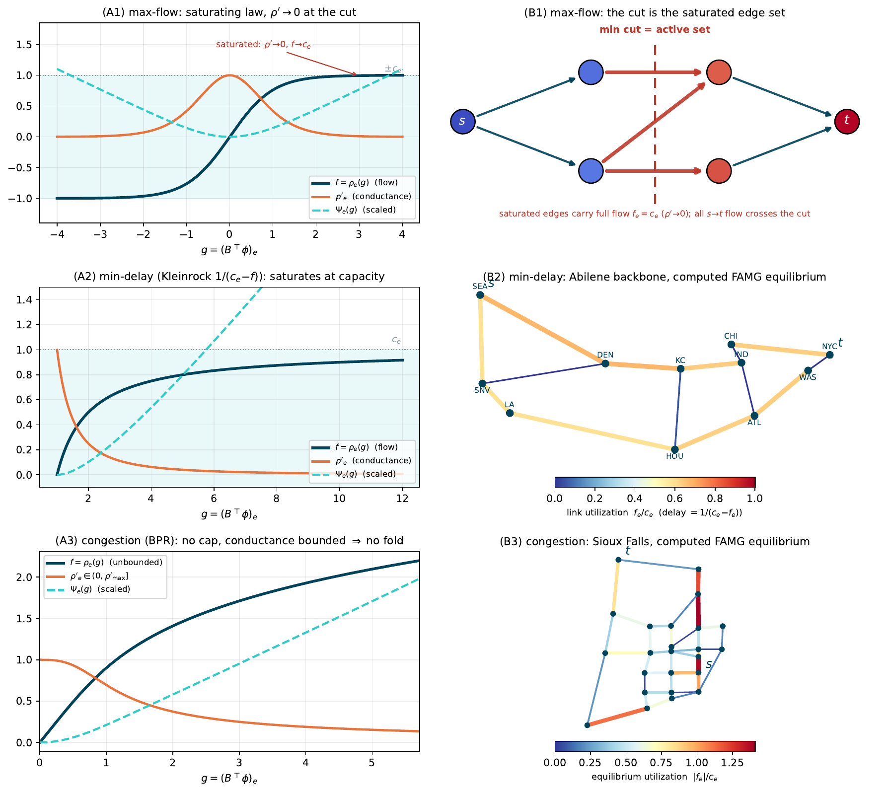
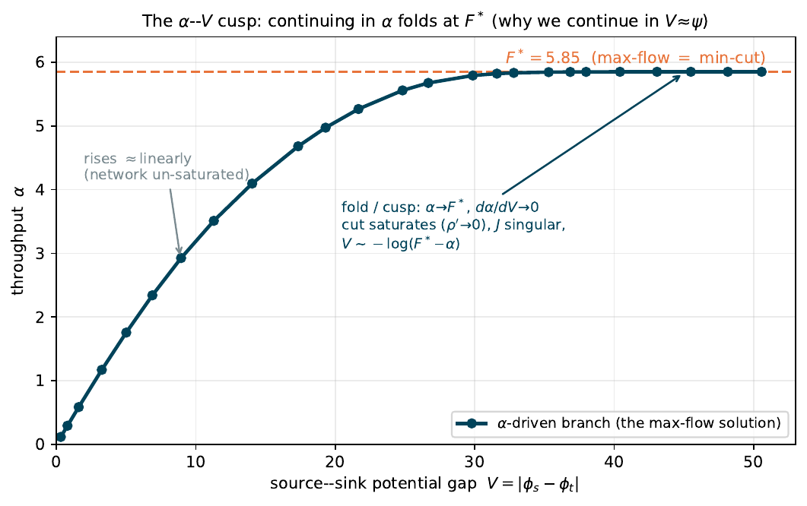
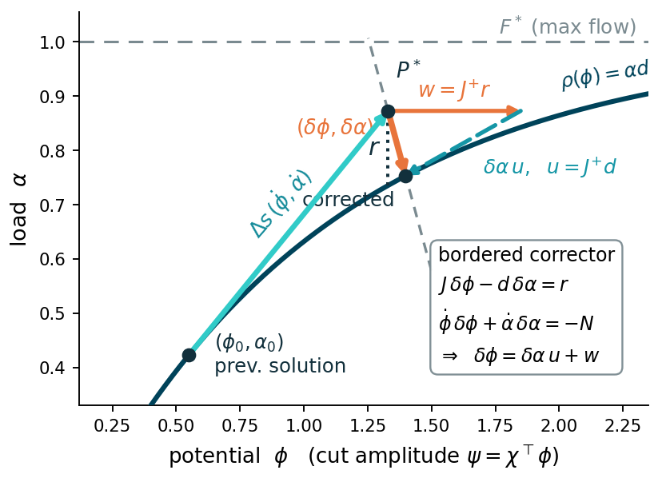
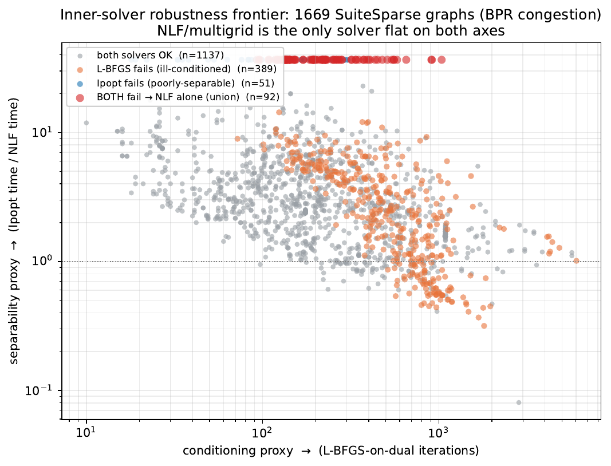
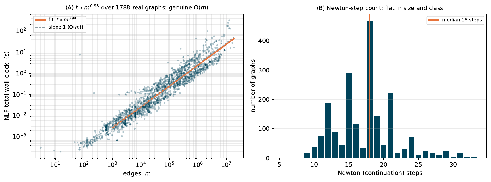

# NLF — Nonlinear Laplacian Flow

A unified **resistor-network framework** and **near-linear-time solver** for convex, edge-separable
network-flow equilibria

```
B ρ(Bᵀφ) = α d .
```

A single monotone edge law `ρ` casts congestion (traffic) routing, minimum-delay routing, and
**maximum flow** as one *nonlinear graph Laplacian*. NLF solves it by a damped chord-Newton iteration
on a frozen linearization — itself a weighted graph Laplacian — with pseudo-arclength continuation and
deflation through the saturating **fold** (the feasibility limit at which the law saturates and the
Jacobian becomes singular). The whole nonlinear solve costs **2–4 linear Laplacian solves**, empirically
near-linear (`t ∝ m^0.98`) across the SuiteSparse corpus. See [`doc/nlf_sisc.tex`](doc/nlf_sisc.tex) for
the paper.

> NLF's inner linear solve is delegated to **[LAMG+](https://github.com/orenlivne/lamgplus)** (the
> `LAMG` package), consumed as a dependency — this repository is the **nonlinear** flow layer only and
> does **not** vendor any LAMG+ source. The inner solver is a swappable module: approximate Cholesky and
> sparse-direct factorization reach the identical `F*` through the fold.

<p align="center"></p>

<p align="center"><em>Fig. 2.1 — one monotone edge law <code>ρ</code> places maximum flow (saturating tanh), minimum-delay routing (Kleinrock), and congestion (BPR) under a single nonlinear graph Laplacian. Whether <code>ρ</code> saturates fixes the easy/hard (no-fold / fold) dichotomy.</em></p>

<p align="center">
  &nbsp;&nbsp;
  
</p>

<p align="center"><em>Fig. 3.2 — (left) As load <code>α</code> rises the source–sink gap <code>V</code> grows until <code>α</code> folds onto <code>F*</code> as the min cut saturates (<code>J</code> singular). (right) Pseudo-arclength predictor–corrector: the predictor advances a fixed arclength <code>Δs</code> along the solution curve; the corrector drives the equilibrium residual <em>r</em> and the arclength residual <em>N</em> to zero, stepping through the fold without stalling.</em></p>

## Results at a glance

Across the SuiteSparse corpus, NLF (multigrid-Newton) is the only one of three solver paradigms robust
on **both** failure axes — it finishes within budget where a first-order method is iteration-blown
(ill-conditioning, right) *and* where a sparse-direct interior-point method is fill-blown (poor
separation, top). In the upper-right corner both competitors fail and NLF is the only solver that
finishes:

<p align="center"></p>

The whole nonlinear solve costs **2–4 linear Laplacian solves**, and the total wall-clock is empirically
near-linear (`t ∝ m^0.98`) over five size-decades of real-world graphs:

<p align="center"></p>

## Requirements

- [Julia](https://julialang.org) ≥ 1.10.
- [LAMG+](https://github.com/orenlivne/lamgplus) (the `LAMG` package) — pulled automatically via the
  `[sources]` entry in [`Project.toml`](Project.toml). The core solver otherwise needs only Julia
  standard libraries (`LinearAlgebra`, `SparseArrays`, `Random`, `Statistics`, `Printf`).
- The three-paradigm **competitor** comparison additionally uses `JuMP`+`Ipopt` (interior point),
  `Optim` (L-BFGS-on-the-dual), and `Laplacians` (approxChol). These live in the reproduction
  environment, not the core package — see [Reproducing the paper](#reproducing-the-paper).

## Install

```julia
julia --project=. -e 'using Pkg; Pkg.instantiate()'
```

## Quickstart — exact maximum flow as a short sequence of Laplacian solves

```julia
using NLF

prob = nlf_grid2d(16)                              # 16×16 grid max-flow instance (saturating law → a fold)
Fstar, φ, f, info = nlf_maxflow(prob; inner = :multigrid)   # chord-Newton + arclength continuation to F*

@show Fstar                                        # exact max-flow value (matches LP / push–relabel)
@show info.steps, info.converged                   # flat continuation-step count; converged at the fold
```

The inner linear solver is interchangeable — the continuation is solver-agnostic and returns the
identical `F*`:

```julia
nlf_maxflow(prob; inner = :multigrid)   # LAMG+ algebraic multigrid (near-linear, the scalable default)
nlf_maxflow(prob; inner = :direct)      # exact sparse Cholesky (fastest where it fits)
```

For **congestion (no-fold)** routing under the BPR law, and the head-to-head against the interior-point
and first-order baselines, see the notebook and `scripts/` below.

## Run the test suite

```bash
julia --project=. test/runtests.jl
```

## Examples (`examples/`)

[`examples/nlf_demo.ipynb`](examples/nlf_demo.ipynb) — run and **time** NLF on a **fold** (max-flow), a
**no-fold** (congestion) instance, and side-by-side with the **competitors** (interior-point Ipopt,
first-order L-BFGS-on-the-dual), checking the reproduced timings and `F*`/objective against the paper's
tables.

## Reproducing the paper

The corpus experiments run over the [SuiteSparse Matrix Collection](https://sparse.tamu.edu) (2003
graphs, tens of GB) and road networks from [TNTP](https://github.com/bstabler/TransportationNetworks);
we **do not** ship the matrices. A small set of the graphs the notebook uses is in [`data/`](data/);
download the rest as Matrix Market `.mtx` into `data/`.

| paper table / figure | script |
|---|---|
| Robustness frontier — NLF vs Ipopt vs L-BFGS (Table 3.1, Fig. 3.1) | [`scripts/run_corpus_3solver.jl`](scripts/run_corpus_3solver.jl) |
| Fold inner-solver swap — LAMG+/approxChol/direct/diagPCG (Table 5.2) | [`scripts/run_fold_bakeoff.jl`](scripts/run_fold_bakeoff.jl) |
| Max-flow exactness (Table 4) | [`scripts/run_nlf_maxflow_validate.jl`](scripts/run_nlf_maxflow_validate.jl) |
| Scaling & cost-vs-accuracy (Figs. 4) | `scripts/run_nlf_scaling.jl`, `scripts/run_nlf_accuracy.jl` + `scripts/fig_nlf_*.py` |
| BPR congestion validation (Table 4) | [`scripts/run_nlf_bpr.jl`](scripts/run_nlf_bpr.jl) |

**Reproducibility notebook.** [`examples/nlf_demo.ipynb`](examples/nlf_demo.ipynb) re-runs NLF (and the
competitors) **live** on representative small/medium instances and asserts the reproduced timings and
`F*`/objective match the paper. One-time setup of the lean reproduction environment (NLF + LAMG+ +
competitors), from the repo root:

```bash
julia --project=examples/repro_env -e 'using Pkg; Pkg.instantiate()'
# register an IJulia kernel if needed:
julia --project=examples/repro_env -e 'using Pkg; Pkg.add("IJulia"); using IJulia; installkernel("Julia")'
cd examples && jupyter nbconvert --to notebook --execute --inplace nlf_demo.ipynb
```

**Build the paper:**

```bash
cd doc && pdflatex nlf_sisc.tex && pdflatex nlf_sisc.tex
```

## Citing

```bibtex
@misc{nlf,
  author = {Oren E. Livne},
  title  = {{NLF}: A Resistor-Network Framework and Linear-Time Solver for Convex Network-Flow Equilibria},
  year   = {2026},
  note   = {\url{https://github.com/orenlivne/nlf}}
}
```

NLF's inner linear solver is **LAMG+** (Livne, *arXiv:2606.24791*, 2026,
[github.com/orenlivne/lamgplus](https://github.com/orenlivne/lamgplus)), a faithful re-derivation of
Lean Algebraic Multigrid (Livne & Brandt, *SIAM J. Sci. Comput.* **34**(4), B499–B522, 2012).

## License

MIT — see [`LICENSE`](LICENSE).
